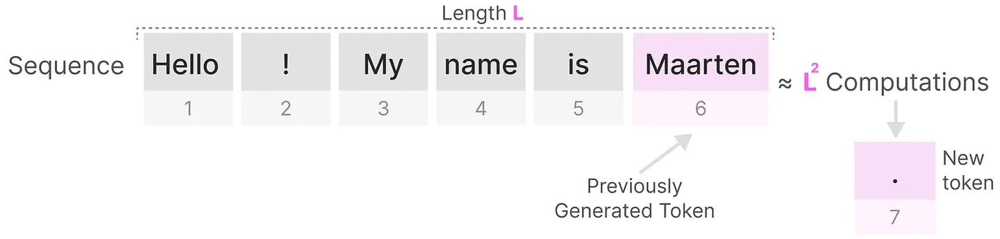
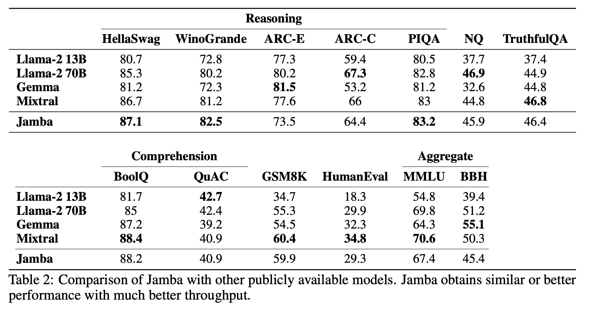

# Jamba

[英文论文](https://arxiv.org/pdf/2403.19887.pdf)

本文先从SSM开始介绍，然后引出Mamba模型，最后介绍Jamba模型。

### 大纲
- **背景介绍**
    - 简要介绍：SSM名词概念引入
    - 动机：为什么要做SSM？
    - 细节：SSM是什么？
- **SSM  ->  S4**
    - 2022-ICLR-accepted -> Efficiently Modeling Long Sequences with Structured State Spaces[^1]
- **S4  ->  S6**
    - 2024-ICLR-rejected -> Mamba: Linear-Time Sequence Modeling with Selective State Spaces[^2]

<p align="center">

</p>

- **Jamba**
    - 2024.3.28->A Hybrid Transformer-Mamba Language Model

## 

## 背景介绍

### SSM 状态空间模型 （名称概念引入）

**SSM是用于描述序列在各时间步的状态表示，并根据输入预测其下一个状态的模型**。SSM是控制理论中常用的模型，在卡尔曼滤波、隐马尔可夫模型都有应用。它是利用了一个中间的状态变量，使得其他变量都与状态变量和输入线性相关，极大的简化问题。

<p align="center">

</p>

### 动机，为什么要做SSM？

传统的神经网络编码模型主要是RNN、CNN、Transformer这三类模型。
- RNN的优势和劣势：
    - 优势：
        - 线性空间占用，结构简单->推理速度快
    - 劣势：
        - 串行导致训练速度极慢，梯度需要反向传播到各个单元
        - 遗忘问题，无法有效处理长程依赖关系，即使有各种门控也只是减缓，无法根治
- CNN的优势和劣势：
    - 优势：
        - 线性空间占用，可以并行训练
    - 劣势：
        - 仅关注局部特征，忽略了全局特征
        - 推理速度慢，固定的卷积核限制了推理速度，需要用卷积核实现乘和加的操作
- Transformer的优势和劣势：
    - 优势：
        - 可以并行训练，并且可以较好捕捉长程依赖关系
    - 劣势：
        - 时间和空间复杂度过大，都是 $O(N^2)$
        - 复杂注意力计算导致推理速度缓慢

<p align="center">

</p>

- 总结：

| Model       | Training | Inference |
|:-----------:|:--------:|:---------:|
| RNN         | Slow     | Fast      |
| CNN         | Fast     | Slow      |
| Transformer | Fast     | Slow      |
| SSM         | Fast     | Fast      |


### 状态空间模型的细节：
1. 基本符号：
- 输入序列： $x(t)$ 
- 隐状态表示： $h(t)$ 
- 预测输出序列： $y(t)$ 
2. 公式表示：
- $h'(t) = \mathbf{A}h(t) + \mathbf{B}x(t)$
- $y(t) = \mathbf{C}h(t) + \mathbf{D}x(t)$

<p align="center">

</p>

- 状态方程包含两个部分：通过矩阵 A 描述状态的变化；通过矩阵B描述输入如何影响状态。

<p align="center">

</p>

-  $h(t)$ 指的是任何给定时间 $t$ 的潜在状态表示，而 $x(t)$ 指的是某个输入。输出方程描述了状态如何转换为输出（通过矩阵 $\mathbf{C}$ ）以及输入如何影响输出（通过矩阵 $\mathbf{D}$ ）。

<p align="center">

</p>

- 整体过程：

<p align="center">

</p>

- *参数细节*，参数矩阵 $\mathbf{D}$ 只起到了残差连接的作用，因此通常把阴影部分看做SSM结构。

<p align="center">

</p>

<p align="center">

</p>


3. 连续函数离散化--零阶保持（连续函数离散化有几个主流方法：欧拉法、零阶保持法、一阶保持法）
-  $h_t = \bar{\mathbf{A}}h_{t-1}+\bar{\mathbf{B}}x_t, \ \ h_0 = \bar{\mathbf{B}}x_0$ 
-  $y_t = \bar{\mathbf{C}}h_t$ 

4. 卷积与递归双重属性

$$
\begin{equation}
\begin{aligned}
y_2 &= \mathbf{C}h_2 \\
& = \mathbf{C}(\bar{\mathbf{A}}h_1 + \bar{\mathbf{B}}x_2) \\
& = \mathbf{C}(\bar{\mathbf{A}}(\bar{\mathbf{A}}h_0 + \bar{\mathbf{B}}x_1) + \bar{\mathbf{B}}x_2) \\
& = \mathbf{C}(\bar{\mathbf{A}}(\bar{\mathbf{A}}\cdot\bar{\mathbf{B}}x_0 + \bar{\mathbf{B}}x_1) + \bar{\mathbf{B}}x_2) \\
& = \mathbf{C}(\bar{\mathbf{A}} \cdot \bar{\mathbf{A}}\cdot\bar{\mathbf{B}}x_0 + \bar{\mathbf{A}}\cdot \bar{\mathbf{B}}x_1 + \bar{\mathbf{B}}x_2) \\
& = \mathbf{C}\cdot\bar{\mathbf{A}}^2 \cdot \bar{\mathbf{B}}x_0 + \mathbf{C}\cdot\bar{\mathbf{A}}\cdot \bar{\mathbf{B}}x_1 + \mathbf{C}\cdot\bar{\mathbf{B}}x_2
\end{aligned}
\end{equation}
$$

- 为什么可以看成是卷积运算？
    - 上面的式子可以转换成以下运算模式，然后进一步从 $y_2$ 到 $y_k$ ，其中，卷积核是通过固定数值的矩阵得到的，只要能确定 $\mathbf{A}, \mathbf{B}, \mathbf{C}$ 三个矩阵，就可以并行运算。

$$
y_2 = \begin{pmatrix}
\bar{\mathbf{C}}\bar{\mathbf{A}}^2\bar{\mathbf{B}} & \bar{\mathbf{C}}\bar{\mathbf{A}}^{1}\bar{\mathbf{B}} & \bar{\mathbf{C}}\bar{\mathbf{A}}\bar{\mathbf{B}}
\end{pmatrix} \begin{pmatrix}
x_0 \\
x_1 \\
x_2
\end{pmatrix}
$$

$$
y_k = \begin{pmatrix}
\bar{\mathbf{C}}\bar{\mathbf{A}}^k\bar{\mathbf{B}} & \bar{\mathbf{C}}\bar{\mathbf{A}}^{k-1}\bar{\mathbf{B}} & ... & \bar{\mathbf{C}}\bar{\mathbf{A}}\bar{\mathbf{B}}
\end{pmatrix} \begin{pmatrix}
x_0 \\
x_1 \\
... \\
x_k
\end{pmatrix}
$$

$$
y = \bar{\mathbf{K}}x
$$

- 为什么可以看成是递归运算？
    - 如果不把括号展开的话，就是一个递归过程，与RNN的工作方式一样。
- **优势**：
    - *训练采用CNN方式并行，提高训练效率*
    - *推理采用RNN方式逐个快速输出*
## 
 
## SSM  ->  S4 (Efficiently Modeling Long Sequences with Structured State Spaces, 2022ICLR accepted)

### SSM存在的问题：
- CNN和RNN的长期依赖捕捉能力都比较弱，这导致SSM同样也存在类似的问题。
    - 问题来源：
        - A矩阵包含着各个时间步隐状态变化的信息，管控着信息遗忘的过程
    - 解决方法：
        - 提出HIPPO矩阵[^3]代替随机初始化的 $A$ 矩阵，HIPPO矩阵利用矩阵分解为低秩矩阵

<p align="center">

</p>

<p align="center">

</p>

- 结论：相比于随机初始化 $\mathbf{A}$ ，使用HIPPO可以有效缓解遗忘问题

<p align="center">

</p>

## 
 
## S4  ->  S6 （Mamba: Linear-Time Sequence Modeling with Selective State Spaces, 2024ICLR rejected）

### Reviewer视角（3688）
- 多数审稿还是更加认可Transformer系列架构，此前SSM还是有些小众了
- 两个8分审稿太划水了，估计没看懂文章，但也是因为作者写的不太友好
- 此外，该文章的ICLR投稿版本确实存在几个问题：
    - 缺乏长序列建模对比实验，其实就是已有的实验没法支撑创新点
    - 都24年了，还期望使用loss和ppl来判断长序列建模的有效性，已经有很多文章[^6]提出loss和ppl已经不说明问题了
### S4存在的问题
- $\mathbf{A}, \mathbf{B}, \mathbf{C}$ 三个矩阵是固定，一旦训练完成，无论新的输入是什么，A都是完全相同的参数，这就会导致模型无法根据输入的信息做针对性的推理，缺少了**选择性**。
- 如果 $\mathbf{A}, \mathbf{B}, \mathbf{C}$ 三个矩阵变成可以根据输入变化，就无法将SSM转化为卷积过程，公式(2)中 $\mathbf{A}, \mathbf{B}, \mathbf{C}$ 三个矩阵是固定的，是可以预计算为卷积核的。公式(3)中 $\mathbf{A}, \mathbf{B}, \mathbf{C}$ 三个矩阵是变化的，无法预计算成卷积核，导致整个模型无法并行运算。

$$
\begin{equation}
\begin{aligned}
y_2 &= \mathbf{C}h_2 \\
& = \mathbf{C}(\bar{\mathbf{A}}h_1 + \bar{\mathbf{B}}x_2) \\
& = \mathbf{C}(\bar{\mathbf{A}}(\bar{\mathbf{A}}h_0 + \bar{\mathbf{B}}x_1) + \bar{\mathbf{B}}x_2) \\
& = \mathbf{C}(\bar{\mathbf{A}}(\bar{\mathbf{A}}\cdot\bar{\mathbf{B}}x_0 + \bar{\mathbf{B}}x_1) + \bar{\mathbf{B}}x_2) \\
& = \mathbf{C}(\bar{\mathbf{A}} \cdot \bar{\mathbf{A}}\cdot\bar{\mathbf{B}}x_0 + \bar{\mathbf{A}}\cdot \bar{\mathbf{B}}x_1 + \bar{\mathbf{B}}x_2) \\
& = \mathbf{C}\cdot\bar{\mathbf{A}}^2 \cdot \bar{\mathbf{B}}x_0 + \mathbf{C}\cdot\bar{\mathbf{A}}\cdot \bar{\mathbf{B}}x_1 + \mathbf{C}\cdot\bar{\mathbf{B}}x_2
\end{aligned}
\end{equation}
$$

$$
\begin{equation}
\begin{aligned}
y_2 &= \mathbf{C}h_2 \\
& = \mathbf{C}(\bar{\mathbf{A}}_2h_1 + \bar{\mathbf{B}}_2x_2) \\
& = \mathbf{C}(\bar{\mathbf{A}}_2(\bar{\mathbf{A}}_1h_0 + \bar{\mathbf{B}}_1x_1) + \bar{\mathbf{B}}_2x_2) \\
& = \mathbf{C}(\bar{\mathbf{A}}_2(\bar{\mathbf{A}}_1\cdot\bar{\mathbf{B}}_0x_0 + \bar{\mathbf{B}}_1x_1) + \bar{\mathbf{B}}_2x_2) \\
& = \mathbf{C}\cdot\bar{\mathbf{A}}_2\cdot\bar{\mathbf{A}}_1\cdot\bar{\mathbf{B}}_0x_0 + \mathbf{C}\cdot\bar{\mathbf{A}}_2\cdot\bar{\mathbf{B}}_1x_1 + \mathbf{C}\cdot\bar{\mathbf{B}}_2x_2
\end{aligned}
\end{equation}
$$

### Mamba的改进
- 参数化矩阵
    - 优化 $\mathbf{A}, \mathbf{B}$ 矩阵为依据输入数据变化的（此优化主要针对于SSM和S4的劣势提出的）
- 硬件感知的并行运算符号
    - 引入了新的可并行运算符号
    - 减少HBM和SRAM通信次数
- 更简单的SSM结构


#### 参数化矩阵
- S6的每个参数矩阵都是动态的，会根据输入发生相应的变化，引入更好的文本推理能力（这部分感觉可以按照静态和动态词向量之间的区别进行理解了）

<p align="center">

</p>

```N代表了Hidden state size，D代表了Size of input vector```

<p align="center">

</p>

```B代表了Batch size，L代表了Sequence length，N代表了Hidden state size.```
- 离散化的过程全都是公式推到，这里暂时不提了...不过要注意的是， $\bigtriangleup$ 是在离散化引入的参数，代表步长，可以类比为视频里的帧数。
- 此外，另一个问题是，就如之前所提到的，当 $\mathbf{A}, \mathbf{B}, \mathbf{C}$ 三个矩阵不是固定值之后，无法预计算为卷积核。那么，带来的新问题就是，没办法实现训练时的加速。因此，作者提出了硬件感知的并行运算符来解决这个问题。

#### 硬件感知的并行运算符号
##### 运算符
- 并行化--选择性扫描算法（Selective Scan Algorithm）
- 不使用传统卷积操作，而是定义了新的“加”运算，在并行计算中，“连加”操作是可以并行的。
- 新的运算符：

<p align="center">

</p>

- 上述运算符满足交换律和结合律，取运算结果中的第二项作为计算结果
- 运算的操作顺序与矩阵 $\mathbf{A}$ 无关

<p align="center">

</p>

- 需要注意的是，是类似二叉树的计算模式，两两计算
##### 硬件感知

<p align="center">

</p>

- 充分发挥SSM显存占用小的优势，把模型和运算过程都在在SRAM上完成。相比之下，Transformer计算时，占用显存过大无法实现。
- HBM：显卡的高带宽内存，提供了比GDDR更高的带宽，更低的功耗。当然，相比于SRAM，HBM仍是”低速大容量“的
- SRAM：显卡的高速缓存区，读取速度非常快
- 对Transformer和SSM：
    - 仅仅注意力层可能就需要把模型各个模块分批次从HBM加载到SRAM区计算，一个模块计算结束就从SRAM取出来，再加载下一个模块，如QKV->Score->Score*V之类的。
    - SSM直接加载到SRAM，然后一步直接得到输出，再从SRAM写回HBM。
- GPU最新的一个缺点是其小型但高效的SRAM与大型但效率稍低的DRAM之间的传输(IO)速度有限。在SRAM和DRAM之间频繁复制信息成为瓶颈。

<p align="center">

</p>

- Mamba 与 Flash Attention 一样，试图限制我们需要从 DRAM 到 SRAM 的次数，反之亦然。它通过内核融合来实现，这允许模型防止写入中间结果并连续执行计算直到完成。

<p align="center">

</p>

- 我们可以通过可视化 Mamba 的基础架构来查看 DRAM 和 SRAM 分配的具体实例：

<p align="center">

</p>

- 这种架构通常被称为选择性SSM或S6模型，因为它本质上是使用选择性扫描算法计算的S4模型。

<p align="center">

</p>

#### 更简单的SSM结构

- 到目前为止，选择性 SSM 可以作为一个块来实现，就像我们在解码器块中表示自注意力一样。与解码器一样，可以堆叠多个 Mamba 块并将它们的输出用作下一个 Mamba 块的输入：

<p align="center">

</p>

- Mamba可以支持多种结构微调

<p align="center">

</p>

<p align="center">

</p>

## Jamba
- 首个建立在新颖的SSM-Transformer混合架构上的产品级Mamba模型
- 长上下文比Mixtral 8x7B吞吐量提高3倍
- 使256K的大型上下文窗口民主化
- 唯一在其规模类别中可在单个GPU上容纳高达140K上下文的模型

总的来说，
- 更快的推理速度
- 更长的上下文
- 更少的算力开销
- 持平的效果

### Jamba的结构：

<p align="center">

</p>

首先，作者先介绍该架构旨在，不仅提供少量的激活参数，而且提供比Transformer小8倍的KV缓存。下表将Jamba与最近公开的模型进行了比较，显示了它在维护小型KV缓存方面的优势，即使在256K上下文中也是如此。

<p align="center">

</p>

### 单个A100 80GB GPU的实现
- 堆叠了4个Jamba blocks的情况下，每个block的参数：
    -  $l = 8$ : the number of layers.
    -  $a:m = 1:7$ : ratio attention-to-Mamba layers.
    -  $e = 2$ : how often to use MoE instead of a single MLP.
    -  $n = 16$ : total number of experts.
    -  $K = 2$ : number of top experts used at each token.
- 下图是单张A100上Jamba和其它模型的上下文支持长度的对比，目前开源出来的模型已经支持到256K，但作者说他们已经成功训练出支持1M上下文长度的Jamba模型。

<p align="center">

</p>

- 下图（a），是单张A100，int8，8K输入长度，512输出长度的吞吐量对比。
- 下图（b），是4张A100，在128K输入长度下的吞吐量对比。
- 此外，作者还强调，Transformer系列模型相比Jamba已经多优化6年了，但是却被Jamba轻松超越，所以，作者认为之后Jamba在经过充分优化后，将会展现出更好的结果。

<p align="center">

</p>

- 作者随后在一些常识推理和阅读理解任务等上进行了实验，都是few shot和zero shot的实验
- 作者一直在强调，Jamba在具有更好吞吐量的情况下，获得了可比或者更好的结果

<p align="center">

</p>


- 作者也评估了大海捞针的效果，单针实验。

<p align="center">

</p>

- 长文QA任务

<p align="center">

</p>

- 作者为了引出下文，所以先讨论了如果把Attention和Mamba做了整合，会有什么好处？
这里先讨论了1.3B的情况。

<p align="center">

</p>
<p align="center">

</p>

- 又讨论了7B的情况

<p align="center">

</p>

<p align="center">

</p>

- 作者考虑到有读者会质疑为什么要对Attention和Mamba整合提出Jamba，而不是纯Mamba模型构造Jamba，因此给出了实验，总的结论就是，两个模型各有一些优势，结合起来就是强强联合。此外，作者还认为如果不做整合，纯Mamba模型可能ICL的结果会差一些。

<p align="center">

</p>

- MoE的消融实验

<p align="center">

</p>

- 作者还通过实验说明了，Jamba不需要位置编码

<p align="center">

</p>

- 有个地方，我有疑问，但还没来得及调研，就是作者在1.3B上训了250B的tokens，但在7B上训了50B的tokens，这是什么逻辑？

##

Note:
本文中许多图片参考了Maarten Grootendorst分享的博客[^4]，十分感谢Maarten Grootendorst的工作！此外，也感谢知乎博主的分享[^5]，但该文章在开始介绍S6模型时切入点有些令人困惑，感觉可以忽略Mamba在引入选择性扫描机制前补充的实验。
[^1]:[Efficiently Modeling Long Sequences with Structured State Spaces](https://arxiv.org/pdf/2111.00396.pdf)
[^2]:[Mamba: Linear-Time Sequence Modeling with Selective State Spaces](https://arxiv.org/ftp/arxiv/papers/2312/2312.00752.pdf)
[^3]:[HiPPO: Recurrent Memory with Optimal Polynomial Projections](https://arxiv.org/pdf/2008.07669.pdf)
[^4]:[A Visual Guide to Mamba and State Space Models](https://newsletter.maartengrootendorst.com/p/a-visual-guide-to-mamba-and-state)
[^5]:[图解Mamba和状态空间模型](https://zhuanlan.zhihu.com/p/687392310)
[^6]:["Paraphrasing The Original Text" Makes High Accuracy Long-Context QA](https://arxiv.org/pdf/2312.11193.pdf)
